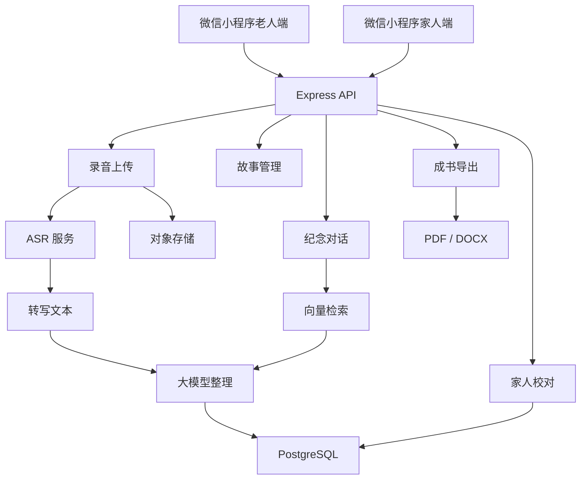

# 技术架构

## 技术选型

- 前端：微信原生小程序，WXML / WXSS / JS。
- 后端：Node.js + Express。
- 数据库：MVP 当前使用内存存储，生产版本切换 PostgreSQL + Prisma。
- 文件存储：生产版本使用腾讯云 COS 或阿里云 OSS。
- ASR：优先腾讯云 ASR，当前为 `asr.service.js` mock。
- 大模型：优先通义千问 / 豆包 / 混元，当前为 `llm.service.js` mock。
- 声音克隆：优先 MiniMax / 火山 / 阿里，当前默认关闭。

## 架构图

## 核心链路

1. 老人点击“开始讲故事”并录音。
2. 小程序上传音频到 `/api/recordings/upload`。
3. 后端创建 recording，并调用 ASR 得到 transcript。
4. 大模型将 transcript 整理为 story 草稿。
5. 家人进入校对页修改 `polishedText`。
6. 书籍导出服务按已整理故事生成书稿。

## 生产化替换点

- `memory-store.js` 替换为 Prisma repository。
- `asr.service.js` 接入真实 ASR。
- `llm.service.js` 接入真实大模型，并增加 prompt 模板。
- `book-export.service.js` 接入 DOCX / PDF 生成。
- `voice-clone.service.js` 在完成本人授权流程后再启用。

